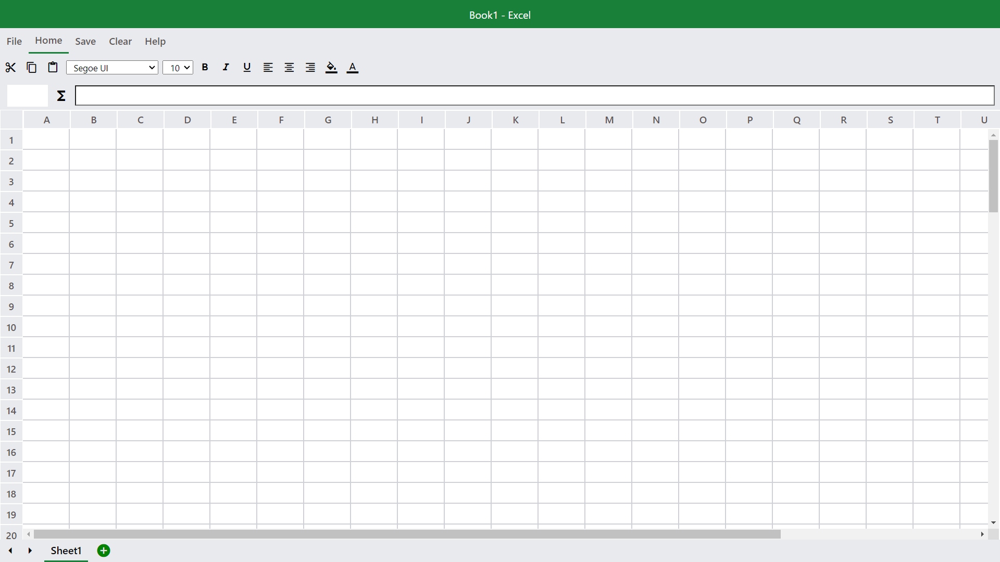

# YG-Sheets
This project is clone of Microsoft Excel which is used by hundreds and Millions of Users throughout the world.

https://25yojangandha.github.io/yg_sheets/

## Features
  ### 1. Saving and Storing data using Local storage
    User can save the current work on website using local storage provided by the browser
  ### 2. Background and text colour
    User can change the background colour of the cell and as well as the colour of text
  ### 3. Text Styling and Alignment
    User can give styling(BOLD, ITALIC, UNDERLINE) and alignment(LEFT,CENTER, RIGHT) to the cell's input
  

